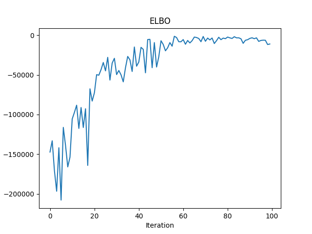
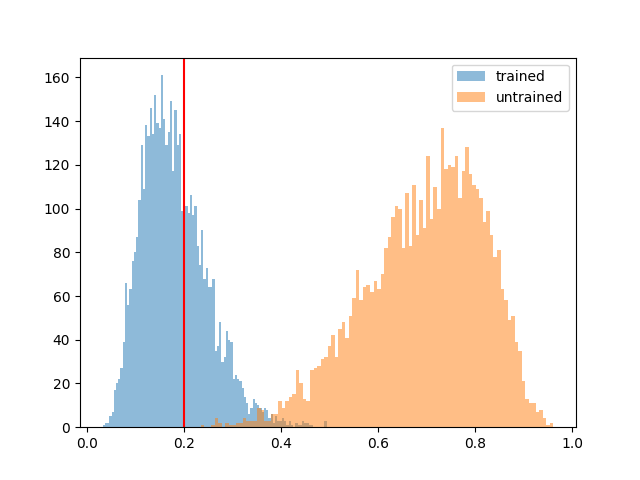

# BlackBIRDS.jl

A Julia package for Bayesian inference using normalizing flows with Agent-Based Models (ABMs), combining variational inference with differentiable ABM simulations.

## Overview

BlackBIRDS enables parameter inference for ABMs by:
- Using differentiable ABM simulations via DiffABM
- Training normalizing flows as variational approximations 
- Supporting various gradient estimation methods for variational inference

## Installation

```julia
using Pkg
Pkg.add(url="https://github.com/arnauqb/BlackBIRDS.jl")
```

## Usage Example: Random Walk Calibration

This example shows how to calibrate parameters of a random walk ABM using variational inference with normalizing flows.

### Setup Dependencies

```julia
using AdvancedVI
using BlackBIRDS
using DynamicPPL
using Distributions
using DiffABM
using PyPlot
using Zygote
using ForwardDiff
using Optimisers
```

### 1. Initialize Model Parameters

```julia
# Create random walk parameters with 100 agents and diffusion rate 0.2
rw = DiffABM.RandomWalkParams(100, ST(), [0.2]) # Use Straight-Through Estimator

# Configure ABM with automatic differentiation backend and loss function
model = ABM(parameters=rw, ad_backend=AutoZygote(), loss=MSELoss(w=2.0))

# Generate synthetic observation data
y_obs = rand(model)
```

### 2. Define Inference Problem

```julia
@model function inference_model(abm, y_obs)
    p ~ Uniform(0, 1)  # Prior on diffusion parameter
    y_obs ~ abm([p])   # Likelihood using ABM simulation
end
```

### 3. Setup Normalizing Flow

```julia
# Create masked autoregressive flow for variational approximation
flow = make_masked_affine_autoregressive_flow_torch(dim=1, n_layers=4, n_units=16)
```

### 4. Train Variational Approximation

```julia
# Run variational inference
flow_trained, stats, flow_untrained, best_model_callback = run_vi(
    model=inference_model(model, y_obs),
    q=flow,
    optimizer=Optimisers.Adam(5e-4),
    n_montecarlo=5,
    max_iter=100,
    adtype=AutoZygote(),
    gradient_method="pathwise",
    entropy_estimation=AdvancedVI.MonteCarloEntropy(),
)
```

### 5. Monitor Training Progress

```julia
# Extract and plot ELBO values
elbo_values = [stat.elbo for stat in stats]
fig, ax = plt.subplots()
ax.plot(elbo_values)
ax.set_title("ELBO")
ax.set_xlabel("Iteration")
ax.set_ylabel("ELBO")
fig.savefig("img/elbo.png")
```



### 6. Analyze Results

```julia
# Sample from trained and untrained flows for comparison
flow_samples = rand(flow_trained, 5000)
untrained_samples = rand(flow_untrained, 5000)

# Compare posterior samples
fig, ax = plt.subplots()
ax.hist(flow_samples[1,:], label="trained", alpha=0.5, bins=100)
ax.hist(untrained_samples[1,:], label="untrained", alpha=0.5, bins=100)
ax.legend()
ax.axvline(0.2, color="red")  # True parameter value
fig.savefig("img/flow_samples.png")
```



The red line shows the true parameter value (0.2) that the trained flow successfully recovers.
